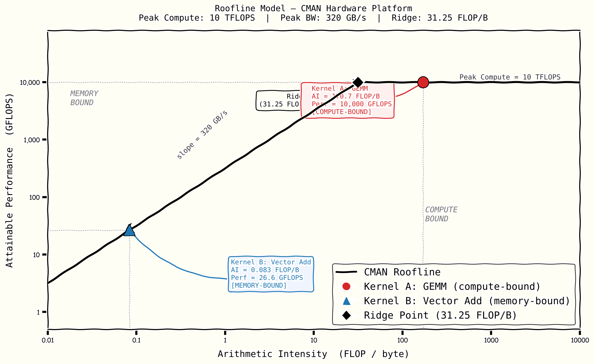

# CMAN Roofline Analysis

**Platform:** CMAN Hardware
**Analysis date:** 2026-04-12

---

## 1. Hardware Parameters

| Parameter | Value |
|---|---|
| Peak Compute | 10 TFLOPS = **10,000 GFLOPS** |
| Peak Memory Bandwidth | **320 GB/s** |
| Ridge Point | Peak Compute / Peak BW = 10,000 / 320 = **31.25 FLOP/byte** |

The ridge point is the arithmetic intensity at which a kernel transitions from
memory-bound to compute-bound. Kernels with AI < 31.25 FLOP/byte are limited by
memory bandwidth; kernels with AI > 31.25 FLOP/byte are limited by compute throughput.

---

## 2. Roofline Model

The attainable performance of any kernel is bounded by:

```
Attainable Performance = min( Peak_BW × AI,  Peak_Compute )
                       = min( 320 × AI,       10,000 )      [GFLOPS]
```

- **Memory-bound region** (AI < 31.25): performance scales linearly with AI along
  the bandwidth slope (320 GB/s).
- **Compute-bound region** (AI > 31.25): performance is capped at the flat ceiling
  (10,000 GFLOPS).

---

## 3. Kernel A — GEMM (Square Matrix Multiply)

### 3.1 Kernel Description

General Matrix Multiply: **C = A × B**, where A is (M×K), B is (K×N), C is (M×N).
Evaluated for square matrices **M = N = K = 1024**, FP32 precision (4 bytes/element).

### 3.2 FLOPs Calculation

Each output element C[i,j] requires K multiply-accumulate (MAC) operations.
Each MAC = 1 multiply + 1 add = **2 FLOPs**.

```
FLOPs = 2 × M × K × N
      = 2 × 1024 × 1024 × 1024
      = 2 × 1,073,741,824
      = 2,147,483,648 FLOPs
      ≈ 2.147 GFLOPs  (per kernel call)
```

### 3.3 Bytes Transferred (no cache reuse)

All matrices loaded/stored from DRAM once. FP32 = 4 bytes/element.

```
Read  A : M × K × 4 = 1024 × 1024 × 4 =  4,194,304 bytes
Read  B : K × N × 4 = 1024 × 1024 × 4 =  4,194,304 bytes
Write C : M × N × 4 = 1024 × 1024 × 4 =  4,194,304 bytes
─────────────────────────────────────────────────────────
Total                                  = 12,582,912 bytes
                                       ≈ 12.0 MB
```

### 3.4 Arithmetic Intensity

```
AI = FLOPs / Bytes
   = 2,147,483,648 / 12,582,912
   = 170.67 FLOP/byte
   ≈ 170.7 FLOP/byte
```

### 3.5 Attainable Performance

```
AI = 170.7  >  Ridge = 31.25  →  COMPUTE-BOUND

Attainable = min( 320 × 170.7,  10,000 )
           = min( 54,624,         10,000 )
           = 10,000 GFLOPS  (at peak compute ceiling)
```

### 3.6 Compute Utilization

```
Utilization = Attainable / Peak_Compute = 10,000 / 10,000 = 100%
```

Kernel A fully saturates the compute units. Adding more memory bandwidth would
**not** improve performance; only higher peak FLOP/s matters.

---

## 4. Kernel B — Vector Addition

### 4.1 Kernel Description

Element-wise vector add: **C[i] = A[i] + B[i]**, for N = 1,000,000 elements,
FP32 precision (4 bytes/element).

### 4.2 FLOPs Calculation

Each element requires exactly **1 floating-point addition**.

```
FLOPs = N = 1,000,000 FLOPs  (per kernel call)
```

### 4.3 Bytes Transferred (no cache reuse)

```
Read  A : N × 4 = 1,000,000 × 4 = 4,000,000 bytes
Read  B : N × 4 = 1,000,000 × 4 = 4,000,000 bytes
Write C : N × 4 = 1,000,000 × 4 = 4,000,000 bytes
──────────────────────────────────────────────────
Total                             = 12,000,000 bytes
                                  = 12.0 MB
```

### 4.4 Arithmetic Intensity

```
AI = FLOPs / Bytes
   = 1,000,000 / 12,000,000
   = 1/12
   ≈ 0.0833 FLOP/byte
```

Note: this result is independent of N — vector add always has AI = 1/12 ≈ 0.083 FLOP/byte
for FP32, because the ratio of 1 FLOP to 12 bytes is constant.

### 4.5 Attainable Performance

```
AI = 0.083  <  Ridge = 31.25  →  MEMORY-BOUND

Attainable = min( 320 × 0.0833,  10,000 )
           = min( 26.67,           10,000 )
           = 26.6 GFLOPS
```

### 4.6 Compute Utilization

```
Utilization = Attainable / Peak_Compute = 26.6 / 10,000 = 0.27%
```

The compute units are almost entirely idle. The kernel stalls waiting for data.
Tripling peak FLOP/s would do nothing; only bandwidth drives performance here.

---

## 5. Summary Table

| Kernel | AI (FLOP/B) | Ridge (FLOP/B) | Bound | Attainable (GFLOPS) | Utilization |
|---|---|---|---|---|---|
| A — GEMM 1024³ | 170.7 | 31.25 | Compute | 10,000 | 100% |
| B — Vector Add | 0.083 | 31.25 | Memory | 26.6 | 0.27% |

---

## 6. Roofline Diagram



- **Red circle** — Kernel A (GEMM): sits at the compute ceiling, 5.5× above the ridge.
- **Blue triangle** — Kernel B (Vector Add): deep in the memory-bound region, 376×
  below the ridge.
- **Diamond** — Ridge point at 31.25 FLOP/byte, 10,000 GFLOPS.

---

## 7. Architectural Recommendations

### 7.1 Kernel A — GEMM (Compute-Bound)

Kernel A already achieves **100% compute utilization**. To improve throughput further:

| Recommendation | Rationale |
|---|---|
| **Add tensor/systolic array units** | GEMM maps perfectly onto matrix engines (e.g., TPU MXU, NVIDIA Tensor Cores). Doubling MAC array width doubles throughput with no memory changes. |
| **Increase clock frequency** | Since compute — not memory — is the bottleneck, higher clock directly raises GFLOPS ceiling. |
| **Tile for on-chip reuse** | Even though Kernel A is compute-bound at the roofline level, cache tiling reduces off-chip traffic and raises effective AI, future-proofing against bandwidth regressions. |
| **Do NOT increase memory bandwidth** | BW is not the bottleneck here. Investment in HBM or wider buses would be wasted on this kernel. |

### 7.2 Kernel B — Vector Add (Memory-Bound)

Kernel B wastes 99.73% of available compute. Architectural fixes must target bandwidth:

| Recommendation | Rationale |
|---|---|
| **Increase memory bandwidth** | The single most effective lever. Doubling BW (320 → 640 GB/s, e.g., via HBM3) doubles attainable GFLOPS from 26.6 → 53.3, with zero microarchitecture changes. |
| **Fuse kernel with neighbors** | If vector add is sandwiched between other ops (e.g., scale → add → ReLU), kernel fusion eliminates round-trips to DRAM for intermediate tensors, raising effective AI. |
| **Widen SIMD / vector lanes** | Wider vector units sustain higher bandwidth utilization per cycle, keeping the memory pipeline saturated. |
| **Do NOT add compute units** | More MACs will sit idle. The kernel cannot consume them while starved for data. |

### 7.3 Cross-Kernel Platform Guidance

Vector-add-class kernels (AI < 1 FLOP/byte) are pervasive in ML workloads (elementwise
activations, layer norm, residual adds). At 0.083 FLOP/byte, Kernel B uses only 0.27%
of the platform's compute. A balanced platform should target a **bandwidth-to-compute
ratio** that matches the workload mix:

```
Ideal BW = weighted_avg(AI_i × Perf_i)  across all kernels
```

For a workload split evenly between GEMM and vector ops, the bottleneck alternates
between compute and memory — the platform should provision at minimum:

```
BW ≥ Peak_Compute / target_AI_floor
   = 10,000 GFLOPS / 31.25 FLOP/B
   = 320 GB/s                          (current — adequate for GEMM)
```

But to make vector add even 10% efficient:

```
BW_needed = 0.10 × Peak_Compute / AI_B
           = 0.10 × 10,000 / 0.083
           ≈ 12,048 GB/s               (far beyond feasible DRAM)
```

This confirms that **kernel fusion and algorithmic restructuring** — not raw bandwidth
scaling — is the only practical path to improving efficiency for inherently low-AI kernels
like vector addition.
